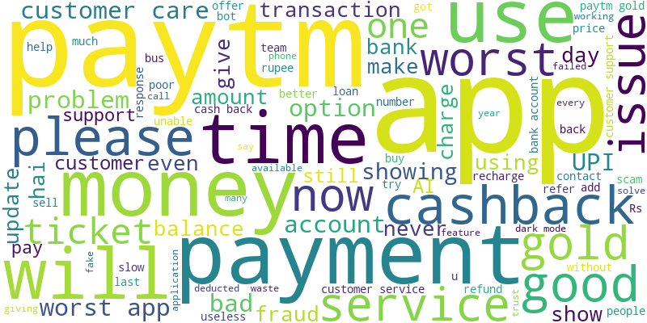

# 📊 Paytm App Review Analysis – End-to-End Research Report

---

## 📂 1️⃣ Data Processing Pipeline

The analysis was conducted in multiple structured steps:

### Step 1: Raw Data Collection
- Dataset included userName, score, content, and timestamp.

### Step 2: English Filtering
- Non-English reviews were removed.
- English Reviews Retained: 2136 (100.00% of total)

### Step 3: Text Cleaning
- Removed stopwords
- Lowercased text
- Removed special characters
- Created `cleaned_review` column

### Step 4: Review Segmentation
- Separate analysis for 1–3 star reviews
- Combined dataset analysis for overall sentiment

### Step 5: Clustering (Theme Identification)
- Applied KMeans clustering
- Optimal clusters determined using elbow method
- Cluster distribution shown below

---

## 🔢 2️⃣ Quantitative Insights

### Total Reviews Analyzed
**2136**

### ⭐ Score Distribution
- 1 Star: 454 reviews (21.25%)
- 2 Star: 40 reviews (1.87%)
- 3 Star: 68 reviews (3.18%)
- 4 Star: 191 reviews (8.94%)
- 5 Star: 1383 reviews (64.75%)

### 🧩 Cluster Distribution
- Cluster 3: 1448 reviews
- Cluster 0: 258 reviews
- Cluster 1: 207 reviews
- Cluster 4: 162 reviews
- Cluster 2: 61 reviews

### 🔤 Top Frequent Words
- app: 946
- and: 654
- good: 554
- the: 543
- is: 534
- to: 524
- very: 516
- i: 499
- paytm: 442
- this: 392
- for: 318
- it: 273
- not: 251
- you: 237
- a: 233

---

## 🧠 3️⃣ Qualitative Insights

### Customer Sentiment Observations
- A significant concentration of lower star ratings indicates dissatisfaction.
- Cluster analysis reveals recurring themes among negative reviews.
- Word frequency patterns highlight key friction areas in the user journey.

### Common User Pain Points (Inferred)
- Transaction failures
- Login and OTP issues
- App performance concerns
- Customer support delays

---

## 📊 4️⃣ Visual Insights

### Word Cloud

### Elbow Plot (Cluster Optimization)

---

## 📌 5️⃣ Final Conclusion

The Paytm app demonstrates high engagement but recurring operational and experience-related friction points. 

Quantitative distribution shows meaningful negative sentiment concentration in lower ratings.  
Qualitative clustering highlights systemic issues rather than isolated complaints.

Addressing high-frequency complaint clusters can significantly improve retention and user satisfaction.

---

## 🎯 Business Recommendation

- Prioritize top complaint cluster resolution
- Improve transaction reliability
- Strengthen customer support responsiveness
- Monitor review trends monthly using automated analysis pipeline

---

